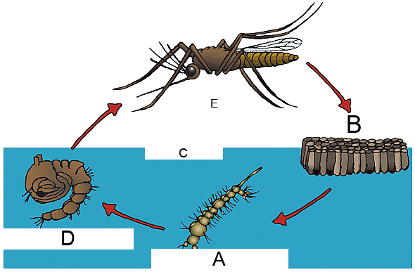

# Multimodal RAG System

A multimodal Retrieval-Augmented Generation system that ingests text and images from AI2D and ChartQA datasets, performs cross-modal retrieval (text-to-text and text-to-image), and generates grounded answers with traceable citations to retrieved evidence.

## Architecture


See [architecture.pdf](architecture.pdf) for the full write-up.

## Repo Structure

```
├── app.py
├── run_tests.py
├── requirements.txt
├── architecture.pdf
├── README.md
├── mmrag/
│   ├── __init__.py
│   ├── config.py
│   ├── schema.py
│   ├── embeddings.py
│   ├── ingest.py
│   ├── vectorstore.py
│   ├── retrieval.py
│   ├── context.py
│   ├── generate.py
│   └── pipeline.py
├── assets/                 # Cited images for test query results
├── logs/                   # Test run logs
└── data/                   # Created at runtime by ingest and vectorstore
```

## Setup & Install

**Prerequisites**: Python 3.10+, CUDA-capable GPU (for Qwen3-VL-8B inference).

```bash
python -m venv .venv
source .venv/bin/activate
pip install -r requirements.txt
```

## Run Sequence

Run all commands from the project root (where `app.py` is located).

The pipeline has three stages. Run them in order.

**Step 1: Ingest datasets**

Downloads AI2D and ChartQA from HuggingFace, deduplicates images, and saves normalized documents to `data/docs/`.

```bash
python -m mmrag.ingest
```

This produces 35,807 text documents and 21,633 image documents.

**Step 2: Build vector store**

Embeds all documents and inserts into ChromaDB. Text documents are embedded with MiniLM-L6-v2 (384-dim), images with CLIP ViT-B/32 (512-dim), stored in separate collections.

```bash
python -m mmrag.vectorstore
```

This step is idempotent. Re-running skips already-populated collections.

**Step 3: Run test queries**

Runs all 6 required queries and saves output to both terminal and `logs/`.

```bash
python run_tests.py
```

To run a single query:

```bash
python app.py --query "Find a chart about comparison across categories."
python app.py --query "Your query here" --top_k 3
```

## Test Queries and Results

Full logs are in `logs/test_results_20260226_224524.log`.

---

### Query 1

```
Query: What does the diagram question say about the correct choice? Return the answer and cite the diagram.

Answer: The retrieved evidence does not contain a specific diagram question that explicitly states
what the correct choice is. The retrieved evidence is insufficient to answer this query.

Citations: 0 valid, 0 invalid
```

---

### Query 2

```
Query: Find a relevant AI2D diagram about a process or cycle. Summarize what it shows in 2 sentences. Cite.

Answer: The diagram shows the life cycle of a plant, illustrating its progression from a seed to a
mature plant and back to seed production [ai2d_0017_img] [ai2d_0017_txt_1]. Another relevant diagram
depicts the life cycle of a mosquito, showing its stages from egg to adult, including larval and pupal
forms [ai2d_0313_img] [ai2d_0608_txt_2].

Citations: 4 valid, 0 invalid
```




---

### Query 3

```
Query: Retrieve a diagram and its paired text with the same group_id. Explain how you linked them. Cite both.

Answer: Diagram: [ai2d_0373_img]
Paired Text: [ai2d_0373_txt_0], [ai2d_0373_txt_1], [ai2d_0373_txt_2]

I linked them by observing that the group_id ai2d_0373 is shared between the image and all three text
results. The text provides descriptions of the diagram's stages, such as identifying "A" as the "check
phase" and "B" as the "Act" phase, which directly correspond to the labels in the diagram.

Citations: 4 valid, 0 invalid
```


---

### Query 4

```
Query: Find a chart about comparison across categories. State which category is highest. Cite the chart.

Answer: The bar chart comparing revenue across pharmaceutical categories shows that "Vaccines" recorded
the highest value. [chartqa_3397_img] [chartqa_3397_txt_0]

Citations: 2 valid, 0 invalid
```


---

### Query 5

```
Query: Find a chart question that requires reading values. Answer it and cite chart + text evidence.

Answer: The chart question "What was the value of imports from Nigeria in dollars in 2020?" requires
reading a value from the chart. The chart shows the import volume in billion U.S. dollars, and the value
for 2020 is explicitly labeled as 1.48. [chartqa_5836_img] [chartqa_5836_txt_0]

Citations: 2 valid, 0 invalid
```


---

### Query 6

```
Query: Retrieve a chart and produce a one-sentence operator summary (what a technician would do next). Cite.

Answer: The bar chart shows the prevalence of bipolar disorder by age group worldwide in 2000, with the
highest prevalence (0.87%) in the 20-24 age group and the lowest (0.14%) in the 5-14 age group
[chartqa_0687_img] [chartqa_0687_txt_0]. A technician would next analyze this data to identify
age-specific trends in bipolar disorder prevalence for public health planning or research purposes.

Citations: 2 valid, 0 invalid
```


---

### Summary

Zero hallucinated citations across all 6 queries. Queries 2 through 6 produced grounded answers with valid citations to both text and image evidence. Query 1 abstained because the meta-referential phrasing ("what does the diagram question say about the correct choice") does not match well against stored QA pairs in the dense retrieval space. The system correctly identified insufficient evidence and declined to fabricate an answer. A hybrid retrieval approach combining BM25 keyword matching with dense retrieval would handle this query type.


## Known Limitations and Improvements

**Query 1 ABSTAIN**: The query's meta-referential phrasing ("what does the diagram question say about the correct choice") does not match well against stored QA-pair text in MiniLM's embedding space. The retriever returns tangentially related results about diagram labels, and the VLM correctly abstains rather than fabricating an answer. A hybrid retrieval approach combining BM25 keyword matching with dense retrieval would handle this query type, as BM25 would match on terms like "correct choice" and "answer" that appear literally in the stored text.

**In-memory group_id lookup**: The ContextBuilder loads all 57K documents into memory for bidirectional group_id resolution. This works at current scale but does not scale to 1M+ documents. The production alternative is using ChromaDB's `where` filter on `group_id` at query time, or an external key-value store (Redis, PostgreSQL) with indexed lookups.

**CLIP retrieval diversity**: CLIP ViT-B/32 text-to-image retrieval with generic queries tends to surface the same visually prototypical diagrams across different queries. A domain-adapted vision encoder fine-tuned on scientific diagrams and charts would improve retrieval precision and diversity.

**Text citation under-representation**: The VLM occasionally cites only image IDs without paired text IDs, despite the system prompt instructing it to cite both modalities. Stronger prompt engineering or a post-generation citation augmentation step (automatically adding paired text IDs when only the image is cited) would address this.
